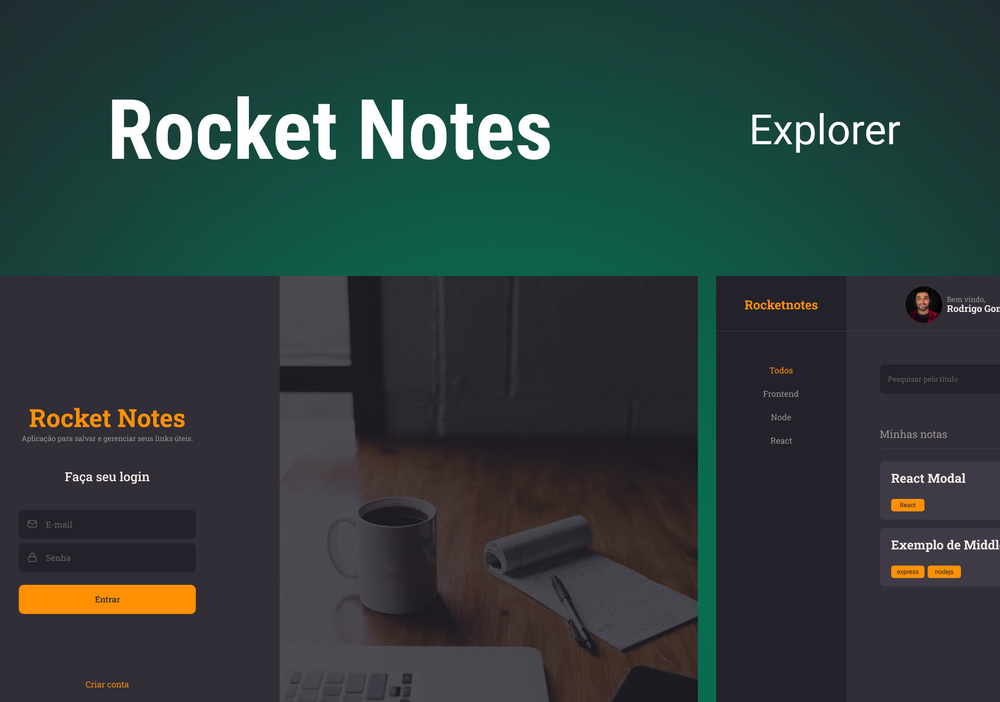

<p align="center">
  <h4 align="center">RocketNotes</h4>
</p>

## 💻 About:

The application developed is to manage notes useful links, where it is necessary to authenticate to enter the application through the login screen.

The user can create a new note, and on the Home page see all the notes he has already created.

- [ReactJs](https://reactjs.org)
- [Node.js](https://nodejs.org/en/)
- [Javascript](https://developer.mozilla.org/pt-BR/docs/Web/JavaScript)
- [Vite](https://vitejs.dev/)
- [Express](https://expressjs.com)
- [Nodemon](https://nodemon.io/)
- [SQLite](https://www.sqlite.org/index.html)
- [Knex](https://knexjs.org/)
- [BCryptjs](https://www.npmjs.com/package/bcryptjs)
- [JSON Web Token](https://www.npmjs.com/package/jsonwebtoken)
- [Multer](https://www.npmjs.com/package/multer)
- [CORS](https://www.npmjs.com/package/cors)
- [Axios](https://www.npmjs.com/package/axios)
- [Styled Components](https://styled-components.com/)
- [React Icons](https://react-icons.github.io/react-icons/)
- [React Router Dom](https://react-icons.github.io/react-icons/)
---

## Features

- [x] A structured project, with a good organization of folders, division of components on the front-end, etc.
- [x] A README.md file with the specifications on how to run the project in a dev environment.
- [x] Users will need to authenticate to enter the application through the login screen.
- [x] Meaningful names for functions and variables: Working a bit with Clean Code concepts.
- [x] Possibility to search for the name of the note.
- [x] Its interface consumes my own API.
- [x] Meets the model proposed in Figma and contains elements indicative of action and state.

---

## 🎨 Layout

The layout of the application is available in Figma:

<a href="https://www.figma.com/file/j7uqZB23TCh3GiVqJOK3bp/RocketNotes-(Copy)?node-id=0%3A1&mode=dev">
  
</a>


## 🚀 How to run the project.

This project is divided into two parts:
1. Backend (API) 
2. Frontend 

💡The Backend must be running on your machine in order for the frontend to be re-addressed.

### Prerequisites

Before you begin, you will need to have the following tools installed on your machine:
[Node.js] (https://nodejs.org/en/). 
Also, it's good to have an editor to work with the code, such as [VSCode](https://code.visualstudio.com/)


### 🚧 Running the BackEnd (server)

```bash
# Download from the repository
$https://github.com/Gabrielingnau/BackEndNotes

git init

git clone https://github.com/Gabrielingnau/BackEndNotes

# Install the necessary dependencies
$ npm install

# Now start the BackEnd server
$ npm run dev

# The server will start at port:3333 - go to <http://localhost:3333>
```


### 💻 Running the FrontEnd

```bash

git init

git clone https://github.com/Gabrielingnau/Rocketnotes

# Install the necessary dependencies
$ npm install

# Now start the BackEnd server
$ npm run dev

# The server will start at port:3333 - go to <http://localhost:3333>

```
---

## 🛠 Technologies

This project was developed with the following technologies:

- HTML
- CSS
- JavaScript
- Node.js
- React.js

---
⌨️ with ❤️ by [Gabriel Lingnau](https://github.com/Gabrielingnau) 😊
=======
